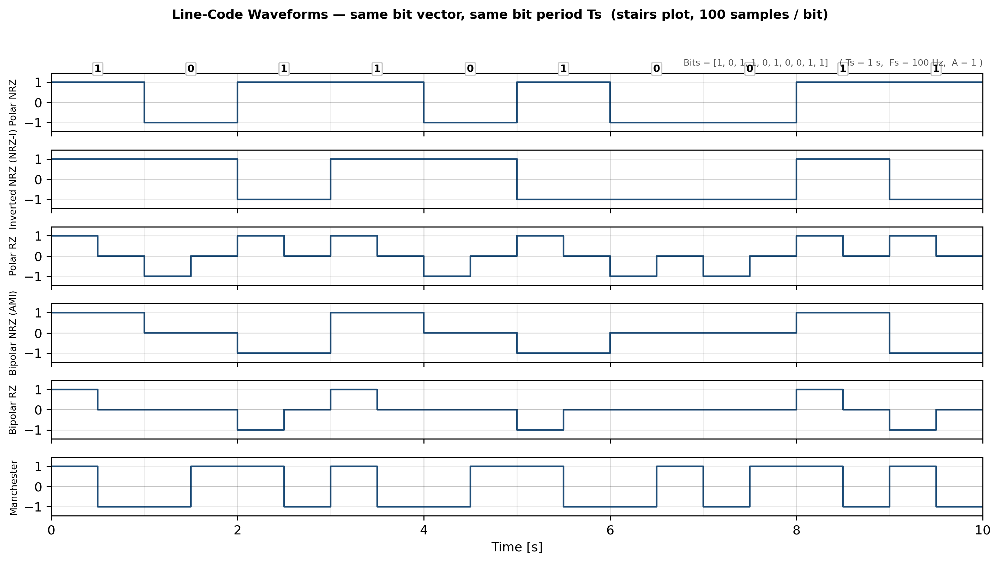
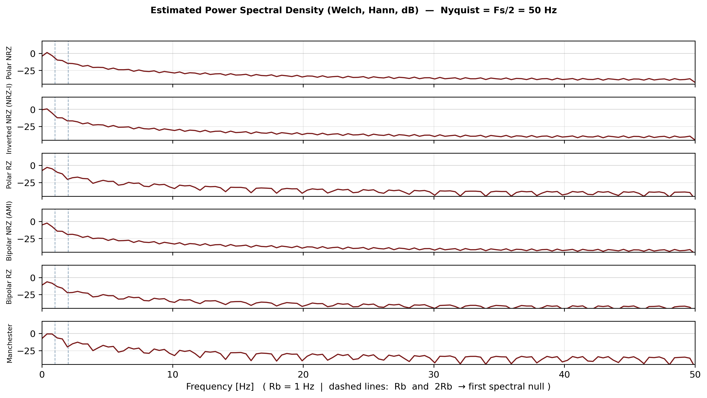

# Lab 1 — Line Codes (Digital Baseband Modulation)

> **Digital Communications Laboratory** — MATLAB implementation and spectral analysis of six fundamental line codes on the same random bit vector. Waveforms + Welch PSD, bandwidth comparison, and engineering trade-offs.

[](https://mathworks.com)
[](#license)
[](#)
[](#)

---

## Table of Contents

- [Overview](#overview)
- [What Is a Line Code?](#what-is-a-line-code)
- [The Six Codes at a Glance](#the-six-codes-at-a-glance)
- [Repository Structure](#repository-structure)
- [Simulation Parameters](#simulation-parameters)
- [How the Code Works](#how-the-code-works)
- [Results — Waveforms](#results--waveforms)
- [Results — Power Spectral Density](#results--power-spectral-density)
- [Bandwidth Comparison](#bandwidth-comparison)
- [Engineering Trade-offs](#engineering-trade-offs)
- [MATLAB Console Output](#matlab-console-output)
- [Running the Lab](#running-the-lab)
- [Reproducing Figures in Python](#reproducing-figures-in-python)
- [Two Other Codes Used in Practice](#two-other-codes-used-in-practice)
- [References](#references)
- [License](#license)

---

## Overview

This lab answers one question: **how does the choice of line code change what the channel actually sees?**

The same 10-bit random vector is encoded with six different rules, plotted on a common time base (`stairs`, 100 samples/bit), and its power spectral density is estimated with Welch's method (`pwelch`). All six codes share the same bit period `Ts` so differences in pulse shape, DC content, transition density, and spectral occupancy are directly comparable.

**Key takeaway:** NRZ codes are the most bandwidth-efficient (first null at `Rb`); RZ and Manchester pay ~2× bandwidth for better clock recovery and DC-free transmission. Bipolar/AMI adds built-in error detection.

---

## What Is a Line Code?

In baseband transmission bits are mapped to a voltage waveform `s(t)` — no carrier involved. Each bit occupies one **bit period** `Ts`; the **bit rate** is `Rb = 1/Ts`.

The line code is the *mapping rule* `bits → pulses*. It determines five system-level properties:

| Property | Why it matters |
|---|---|
| **DC content** | AC-coupled channels (transformers, capacitor-coupled links, telephone lines) block DC. Codes that suppress low frequencies are required there. |
| **Self-clocking** | The receiver must recover the bit clock from transitions in `s(t)` itself. More transitions → easier timing recovery. |
| **Bandwidth** | Width of the main spectral lobe (first null) sets the channel bandwidth needed. Narrower is cheaper. |
| **Error detection** | Some codes carry redundancy (e.g., AMI alternation) so a violation signals an error. |
| **Complexity / levels** | 2-level vs 3-level signalling changes threshold count, SNR requirement, and hardware cost. |

---

## The Six Codes at a Glance

| # | Code | Rule (per `Ts`) | Levels | Aliases |
|---|---|---|---|---|
| 1 | **Polar NRZ** | `1 → +A`, `0 → −A`, whole bit | 2 | NRZ-L |
| 2 | **Inverted Polar NRZ** | `1 → flip level`, `0 → hold level` | 2 | NRZ-I, differential NRZ |
| 3 | **Polar RZ** | `1 → +A` / `0 → −A` in **first half**, then `0` | 3 | — |
| 4 | **Bipolar NRZ** | `0 → 0`, `1 → alternating +A / −A` whole bit | 3 | AMI |
| 5 | **Bipolar RZ** | `0 → 0`, `1 → alternating +A / −A` in **first half** only | 3 | AMI-RZ |
| 6 | **Manchester** | `1 → +A then −A`, `0 → −A then +A` (mid-bit transition always) | 2 | Biphase, PE |

`A = 1` in this lab. NRZ = *non-return-to-zero*, RZ = *return-to-zero*.

---

## Repository Structure

```
.
├── README.md                          # ← you are here
├── src/
│   └── Lab1_code.m                    # main MATLAB script (173 lines)
├── assets/
│   └── images/
│       ├── waveforms.jpg              # original MATLAB figure — waveforms
│       ├── psd.jpg                    # original MATLAB figure — PSD (pwelch, dB)
│       ├── waveforms_annotated.png    # regenerated, bit-annotated waveform figure
│       ├── waveforms_annotated.jpg
│       ├── psd_annotated.png          # regenerated, Rb/2Rb-marked PSD (dB)
│       ├── psd_annotated.jpg
│       ├── waveforms_generated.png    # raw Python replica (seed=0)
│       └── psd_dB_generated.png
├── docs/                              # for extended notes (optional)
├── .gitignore                         # excludes Lab1_report.pdf and other artefacts
└── Lab1_code.m                        # original location (kept for compatibility)
```

> The lab report PDF (`Lab1_report.pdf`) is intentionally **not tracked** — it is listed in `.gitignore` per the task requirement. Original JPG captures (`coding lines.jpg`, `Spectral power density.jpg`) are preserved as `assets/images/waveforms.jpg` and `assets/images/psd.jpg`.

---

## Simulation Parameters

| Parameter | Symbol | Value |
|---|---|---|
| Pulse amplitude | `A` | `1` |
| Number of random bits | `N` | `10` |
| Bit period | `Ts` | `1 s` |
| Sampling frequency | `Fs` | `100 Hz` |
| Samples per bit | `Nsp = Ts·Fs` | `100` |
| Total samples | `N·Nsp` | `1000` |
| Bit rate | `Rb = 1/Ts` | `1 Hz` |
| Nyquist frequency | `Fs/2` | `50 Hz` |
| PSD estimator | — | Welch (`pwelch`, Hann, dB scale `10·log10 P`) |

The 100× oversampling (`Fs ≫ Rb`) gives clean stair-step plots and a well-resolved PSD up to Nyquist.

---

## How the Code Works

`src/Lab1_code.m:1-173` — single self-contained script, no toolboxes beyond Signal Processing Toolbox (`pwelch`).

```
clear; clc; close all;
A=1; N=10; Ts=1; Fs=100; Nsp=Ts*Fs; Total=N*Nsp;
data = randi([0 1],1,N);          % random bit vector
t(i) = (i-1)/Fs                   % sample-by-sample time axis
half = Nsp/2;                     % 50 samples = half a bit period
```

Each code fills a `1 × Total` signal vector by looping over bits `k = 1..N` with index math:

```matlab
start = (k-1)*Nsp + 1;   % e.g. k=8 → start = 701
stop  =  k   *Nsp;       % e.g. k=8 → stop  = 800
```

| Signal | Encoding logic (`src/Lab1_code.m:20-92`) |
|---|---|
| `s1` Polar NRZ | `s1(start:stop) = ±A` for the whole bit. |
| `s2` Inv. NRZ | State `level` starts at `−A`; on every `1` flip `level = −level`; fill whole bit with `level`. Differential — immune to polarity inversion. |
| `s3` Polar RZ | `s3(start:start+half−1) = ±A`, second half stays `0`. |
| `s4` Bipolar NRZ | `sign` alternates on successive `1`s; `0` bits stay `0`. |
| `s5` Bipolar RZ | Same alternation, but `s5(start:start+half−1) = sign·A` only. |
| `s6` Manchester | `1 → [+A, −A]`, `0 → [−A, +A]` split at `half`. Guaranteed mid-bit transition. |

**Plotting** — `src/Lab1_code.m:94-128` one `figure` with `subplot(6,1,k)` + `stairs(t, s, 'LineWidth',1.2)`, common `ylim([-1.2A 1.2A])`, shared time axis. **PSD** — `src/Lab1_code.m:130-170` uses `[P,f]=pwelch(s,[],[],[],Fs)` per signal, plotted as `10*log10(P)` with `xlim([0 Fs/2])`.

---

## Results — Waveforms

All six traces below are generated from the **same** random bit vector, on the **same** time scale. Differences are purely the code.

### Original MATLAB output

<p align="center">
  
  <br>
  <em>Fig. 1 — Original MATLAB figure: waveforms of the six line codes (stairs, same Ts).</em>
</p>

### Regenerated annotated figure (bits labelled)

<p align="center">
  
  <br>
  <em>Fig. 1b — Annotated replica (Python/MATLAB-equivalent): bits = [1 0 1 1 0 1 0 0 1 1] shown above the top trace. Bit boundaries are faint vertical lines; every subplot is on the same time base.</em>
</p>

**Reading the figure:**

- **Polar NRZ** — two levels, constant per bit. Transitions only where the data changes. Simplest detector (zero-threshold comparator).
- **Inverted NRZ (NRZ-I)** — level holds through runs of `0`, flips on every `1`. Two consecutive `1`s that look flat in Polar NRZ produce a transition here. Decoding depends only on *whether* a transition occurred → immune to channel polarity inversion, but a single error can corrupt two decoded bits.
- **Polar RZ** — first half carries `±A`, second half always returns to `0`. A transition exists at the start of *every* bit → aids clock recovery, at the cost of 3 levels.
- **Bipolar NRZ (AMI)** — only `1`s produce pulses and they **alternate** `+A / −A`. Long `0` runs leave the line at `0` (idle). Violation of alternation = error flag.
- **Bipolar RZ** — same alternation, half-width pulses. Lowest average power of the six.
- **Manchester** — mid-bit transition in *every* bit (`1 = H→L`, `0 = L→H`). The busiest waveform, self-clocking and DC-free by construction.

---

## Results — Power Spectral Density

Estimated with Welch's averaged periodogram (`pwelch`, built-in MATLAB), Hann window, plotted in dB (`10·log10 P`) up to Nyquist `Fs/2 = 50 Hz`. `Rb = 1 Hz`, so the first spectral nulls at `Rb` and `2·Rb` are clearly visible.

### Original MATLAB output

<p align="center">
  
  <br>
  <em>Fig. 2 — Original MATLAB figure: estimated PSDs (Welch, dB) up to Nyquist. Dashed notion: first spectral null marks main-lobe bandwidth.</em>
</p>

### Regenerated annotated PSD (Rb / 2Rb marked)

<p align="center">
  
  <br>
  <em>Fig. 2b — Annotated replica: Welch PSD in dB per code. Vertical dashed lines at f = Rb = 1 Hz and f = 2·Rb = 2 Hz mark the theoretical first null of each pulse shape. Zero-mean codes show no discrete line at DC.</em>
</p>

**Spectral reading:**

| Code | Shape | First null | DC | Notes |
|---|---|---|---|---|
| **Polar NRZ** | `sinc²` | `Rb` | ~0 (zero-mean for equiprobable data) | Narrowest lobe — most bandwidth-efficient. |
| **Inverted NRZ** | `sinc²` (≈ NRZ) | `Rb` | ~0 | Differential rule does not change average PSD. |
| **Polar RZ** | wider `sinc²` | `2·Rb` | ~0 | Half-width pulses → double bandwidth. |
| **Bipolar NRZ (AMI)** | `sin²(πfTs)·sinc²` | `Rb` | **0** (forced null) | Alternation inserts `sin²` factor → null at DC, suppressed low frequencies. Good for AC-coupled channels; violation = error detection. |
| **Bipolar RZ** | `sin²(πfTs)·sinc²` (wide) | `2·Rb` | **0** | AMI null at DC + RZ double width. |
| **Manchester** | `sinc² · sin²` product | `2·Rb` | **0** | Widest main lobe — price of guaranteed mid-bit transition. No baseline wander. |

> All six PSDs here have no discrete spectral lines at DC because the data is zero-mean (equally likely `±A` or with `0`-idle balancing). A non-zero-mean variant (e.g., unipolar) *would* show a DC line.

---

## Bandwidth Comparison

Measured to the **first spectral null** — the standard bandwidth definition for rectangular-pulse line codes.

| Code | First null | Relative bandwidth |
|---|---|---|
| Polar NRZ | `Rb` (1 Hz) | `B` (reference) |
| Inverted NRZ | `Rb` (1 Hz) | `B` |
| Bipolar NRZ (AMI) | `Rb` (1 Hz) | `B` |
| Polar RZ | `2·Rb` (2 Hz) | `2B` |
| Bipolar RZ | `2·Rb` (2 Hz) | `2B` |
| **Manchester** | **`2·Rb` (2 Hz)** | **`2B` — highest** |

**Why Manchester is widest:** it forces a level change at the centre of every bit, so the signalling transition rate is `2·Rb` even though the bit rate is only `Rb`. Its main lobe therefore extends to `2·Rb`. Both RZ codes also hit `2·Rb` because their pulses are half as wide (`Ts/2`).

This is the classic **bandwidth ↔ clocking trade-off**: Manchester buys self-clocking and DC-free transmission with bandwidth; NRZ buys bandwidth efficiency at the cost of clock recovery on long constant runs.

```
Bandwidth
   ^
   |        ┌─────────────┐
2B |        │  RZ family  │  Manchester
   |  ┌─────┤  Polar RZ   ├──────────────┐
   |  │     │  Bipolar RZ │              │
 B |──┤     └─────────────┘              │
   |  │  NRZ family                      │
   |  │  Polar / Inv / AMI               │
   └──┴──────────────────────────────────┴──→  Self-clocking / DC-free
      efficient                          robust
```

---

## Engineering Trade-offs

| Code | Advantages | Disadvantages |
|---|---|---|
| **Polar NRZ** | Simple gen/detect (single zero threshold); 2 levels; narrowest bandwidth (`Rb`); no DC on average | No self-clocking — long constant runs give no transitions; DC wander on unbalanced data; no error detection |
| **Inverted NRZ** | Differential — immune to polarity inversion; a transition on every `1` → slightly better clocking than Polar NRZ; same bandwidth | Long `0` runs still flat (clock loss); one channel error can corrupt two decoded bits (error propagation); no error detection |
| **Polar RZ** | Returns to zero every bit → transition every period, easier clock recovery; no DC on average | Bandwidth doubled (`2·Rb`); 3 levels (`+A, −A, 0`) → higher SNR needed; lower average power |
| **Bipolar NRZ (AMI)** | No DC (alternating pulses cancel) → AC-coupled friendly; built-in error detection (alternation violation); same bandwidth as NRZ | 3 levels; no transitions on long `0` runs; detects but does not correct errors |
| **Bipolar RZ** | No DC; error detection as AMI; half-width pulses → transition inside every `1` bit, easier clock than AMI | Bandwidth doubled (`2·Rb`); 3 levels; lowest average power of the six |
| **Manchester** | **Self-clocking** — guaranteed mid-bit transition every bit; no DC, no baseline wander; differential decoding → polarity-insensitive | **Highest bandwidth** (`2·Rb`, twice NRZ); more complex codec; transition rate doubles |

> **No single "best" code.** The choice is always a trade-off between *bandwidth efficiency*, *clock recovery*, *DC handling*, *error detection*, and *implementation complexity*.

---

## MATLAB Console Output

Every run generates a new random vector via `randi([0 1],1,N)`. Example output (replicated in Python with `seed=0` for documentation):

```
Random bits:
     0     1     1     0     1     1     1     1     1     1
```

The annotated figures in this README use the illustrative vector `[1 0 1 1 0 1 0 0 1 1]` to show runs of both `0` and `1` clearly. Your own run will differ — the *shapes* and *spectra* remain characteristic of each code regardless of the specific bits.

---

## Running the Lab

### Requirements

- MATLAB R2019b+ (uses `sgtitle`, `pwelch` from Signal Processing Toolbox)
- No additional toolboxes required beyond `pwelch`

### Steps

```matlab
% 1. Open MATLAB, set working directory to src/ or repo root
% 2. Run:
Lab1_code

% Two figures appear:
%   - "Waveforms"  (6× stairs subplots, shared time axis)
%   - "Power Spectral Density" (6× Welch PSD in dB, up to Fs/2)
%
% Console prints:
%   Random bits:
%     0  1  0  1  ...
```

### Parameters to experiment with

```matlab
A  = 1;    % try A = 2, 5  (scales PSD by 20*log10 A)
N  = 10;   % try N = 100   (smoother PSD estimate, longer waveforms)
Fs = 100;  % try Fs = 500  (finer stair steps, higher Nyquist)
Ts = 1;    % try Ts = 0.5  (Rb = 2 Hz → nulls shift)
```

---

## Reproducing Figures in Python

The `assets/images/*_annotated.*` and `*_generated.*` figures were regenerated with an equivalent NumPy/SciPy pipeline (Welch with Hann window) for this README. To reproduce:

```bash
pip install numpy matplotlib scipy --break-system-packages
python3 /tmp/gen.py          # raw replica (seed 0)
python3 /tmp/gen_annotated.py  # annotated replica ([1 0 1 1 0 1 0 0 1 1])
```

The encoding logic is line-for-line equivalent to `src/Lab1_code.m:20-92`.

---

## Two Other Codes Used in Practice

Beyond the six implemented here, two additional line codes are common in real systems:

**Unipolar NRZ (On-Off Keying)** — `1 → +A`, `0 → 0` for the whole bit. The simplest code; ubiquitous in optical fibre (light on/off), LED/laser drivers, and TTL/CMOS logic. Cheap but carries a DC component, suffers baseline wander on long `0` runs, and has no clock information during zeros.

**Unipolar RZ** — `1 → +A` in first half then `0`, `0 → 0`. Gives a transition at the start of every `1` (easier clock recovery than Unipolar NRZ) but doubles bandwidth to `2·Rb` and retains the DC problem.

These illustrate the same design axes (levels, DC, bandwidth, clocking) in their simplest form.

---

## References

- Proakis, J. G., & Salehi, M. — *Digital Communications*, 5th ed., McGraw-Hill. Ch. 3 (Baseband transmission, line codes, PSD of PAM).
- Couch, L. W. — *Digital and Analog Communication Systems*, 8th ed. Ch. 3 (PCM and line codes).
- MATLAB `pwelch` documentation — Welch's averaged periodogram method.
- Original lab handout and report: `Lab1_report.pdf` (not tracked; see `.gitignore`).

---

## License

MIT — free for academic and personal use. If you use this lab in coursework, please cite the original course and author.

---

<p align="center">
  <em>Lab 1 — Line Codes · Digital Communications Laboratory · MATLAB · Welch PSD · Bandwidth vs. Clocking Trade-off</em>
</p>
