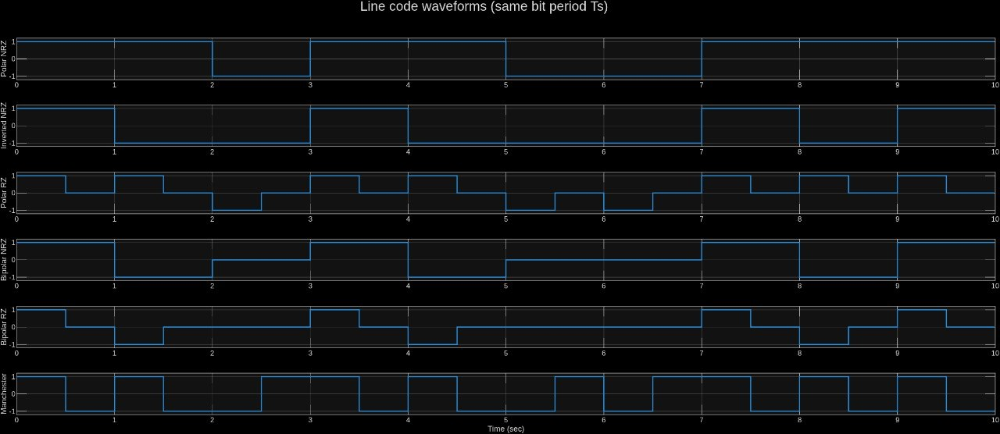
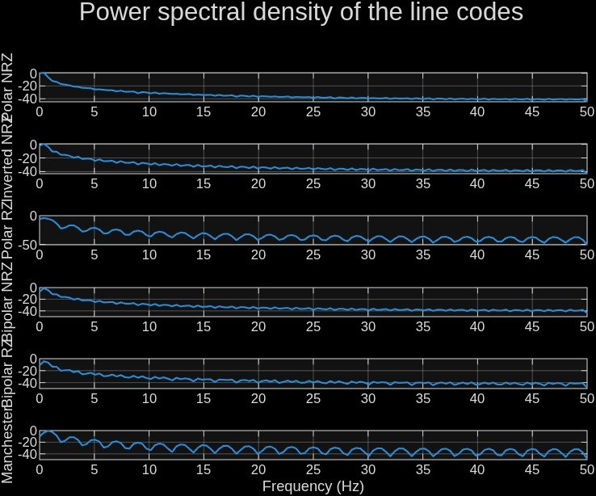

# Lab 1 — Line Codes (Digital Baseband Modulation)

MATLAB implementation of six fundamental line codes on a shared random bit vector, with time-domain waveforms and Welch PSD analysis.

[](https://mathworks.com)
[](#license)

## Overview

The same 10-bit vector is encoded with six different rules and plotted on a common time base (`Ts = 1 s`, `Fs = 100 Hz`). The PSD of each code is estimated with `pwelch` to compare DC content, self-clocking, and bandwidth occupancy directly.

**Result:** NRZ is most bandwidth-efficient (first null at `Rb`); RZ and Manchester need ~2× bandwidth for DC-free, self-clocking transmission.

## Line Codes

| # | Code | Rule per `Ts` | Levels |
|---|---|---|---|
| 1 | **Polar NRZ** (NRZ-L) | `1 → +A`, `0 → −A` (whole bit) | 2 |
| 2 | **Inverted NRZ** (NRZ-I) | `1 → flip`, `0 → hold` | 2 |
| 3 | **Polar RZ** | `1 → +A` / `0 → −A` in first half, then `0` | 3 |
| 4 | **Bipolar NRZ** (AMI) | `0 → 0`, `1 → alt. +A/−A` (whole bit) | 3 |
| 5 | **Bipolar RZ** | `0 → 0`, `1 → alt. +A/−A` (first half) | 3 |
| 6 | **Manchester** | `1 → +A→−A`, `0 → −A→+A` (mid-bit transition) | 2 |

`A = 1`. The choice of code trades **bandwidth ↔ DC suppression ↔ clock recovery ↔ complexity**.

## Simulation Parameters

| Parameter | Value |
|---|---|
| `A` | 1 |
| `N` | 10 random bits (`randi([0 1],1,N)`) |
| `Ts` / `Rb` | 1 s / 1 Hz |
| `Fs` / `Nsp` | 100 Hz / 100 samples/bit |
| PSD | Welch `pwelch(...,Fs)` → `10·log10(P)`, `0–Fs/2` |

## Code Structure — `src/Lab1_code.m:1-173`

```matlab
data = randi([0 1],1,N);          % random bits
t(i) = (i-1)/Fs;  half = Nsp/2;
start = (k-1)*Nsp+1;  stop = k*Nsp;   % per-bit window
```

Encoding loops `k=1..N` (`src/Lab1_code.m:20-92`): `s1` Polar NRZ fills `±A`; `s2` NRZ-I flips `level` on `1`; `s3` Polar RZ fills first half only; `s4`/`s5` Bipolar alternate `sign` on `1`s (full/half bit); `s6` Manchester splits `±A/∓A` at `half`. Plotting: `stairs` + `subplot(6,1,k)` (`src/Lab1_code.m:94-128`). PSD: `pwelch` in dB (`src/Lab1_code.m:130-170`).

## Waveforms

Same bit vector, same `Ts` — differences are purely the code.

<p align="center">
  
  <br><em>Fig. 1 — MATLAB output: six waveforms (stairs, shared time axis).</em>
</p>

- **Polar NRZ:** 2 levels, transitions only on data change. Simple zero-threshold detection.
- **NRZ-I:** level flips on every `1` — immune to polarity inversion.
- **Polar RZ:** returns to `0` every bit → transition each period, aids timing.
- **Bipolar NRZ/RZ (AMI):** `1`s alternate `±A`, `0` stays `0`; alternation violation = error detection. RZ uses half-width pulses.
- **Manchester:** guaranteed mid-bit transition every bit — fully self-clocking, DC-free.

## Power Spectral Density

Welch estimate, Hann window, dB scale, `0–50 Hz` (`Fs/2`). First null marks main-lobe bandwidth.

<p align="center">
  
  <br><em>Fig. 2 — MATLAB output: Welch PSDs in dB (first null at Rb or 2Rb).</em>
</p>

| Code | PSD shape | First null | DC |
|---|---|---|---|
| Polar / Inverted NRZ | `sinc²` | `Rb` | ~0 |
| Polar RZ | wider `sinc²` | `2Rb` | ~0 |
| Bipolar NRZ | `sin²(πfTs)·sinc²` | `Rb` | **0** |
| Bipolar RZ | same (wide) | `2Rb` | **0** |
| Manchester | `sinc²·sin²` | `2Rb` | **0** |

All are zero-mean here (no DC line); bipolar/Manchester force a null at DC — suitable for AC-coupled channels.

## Bandwidth Comparison

Measured to first spectral null:

| Code | First null | Relative BW |
|---|---|---|
| Polar / Inverted / Bipolar NRZ | `Rb` | `B` |
| Polar RZ / Bipolar RZ / **Manchester** | `2Rb` | `2B` (highest) |

Manchester is widest because it toggles at `2Rb` (mid-bit transition every bit). RZ codes are also `2Rb` due to `Ts/2` pulses. Classic **bandwidth vs. clocking** trade-off.

## Trade-offs

| Code | Advantages | Disadvantages |
|---|---|---|
| Polar NRZ | Simple, 2 levels, min. BW | No clock on long runs, no error detect |
| NRZ-I | Polarity-insensitive | `0`-runs still flat, error spread |
| Polar RZ | Transition every bit | `2×` BW, 3 levels |
| Bipolar NRZ | DC-free, error detect, BW=`B` | 3 levels, `0`-runs flat |
| Bipolar RZ | DC-free, error detect, better clock | `2×` BW, 3 levels |
| Manchester | Self-clocking, DC-free | `2×` BW (highest) |

## Running the Lab

```matlab
% In MATLAB (Signal Processing Toolbox for pwelch):
Lab1_code   % from src/ or repo root
% → Figure "Waveforms" + Figure "Power Spectral Density"
% → Console: Random bits:  0  1  1  0  ...
```

Console output is random each run (`randi`), so bit values vary — spectral shapes and trade-offs do not.

## Repository Structure

```
.
├── src/Lab1_code.m          # 173-line MATLAB script
├── assets/images/
│   ├── waveforms.jpg        # Fig. 1 — original MATLAB waveforms
│   └── psd.jpg              # Fig. 2 — original MATLAB PSD (dB)
├── .gitignore               # excludes Lab1_report.pdf (local only)
└── README.md
```

## License

MIT
